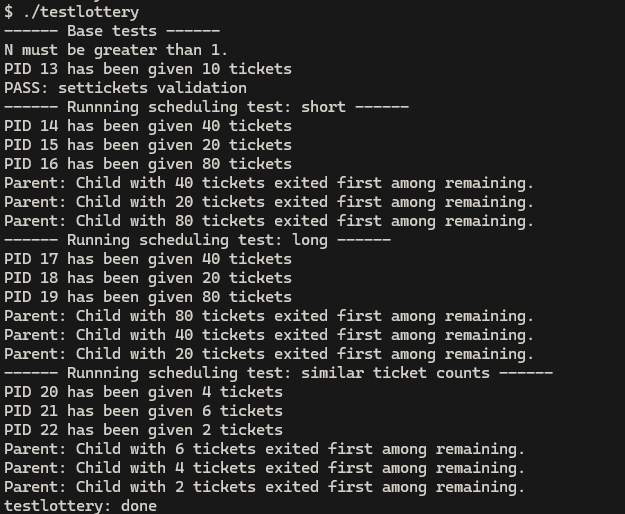
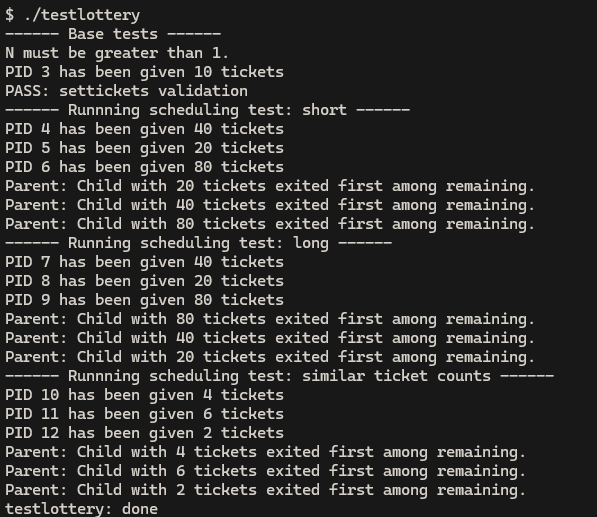
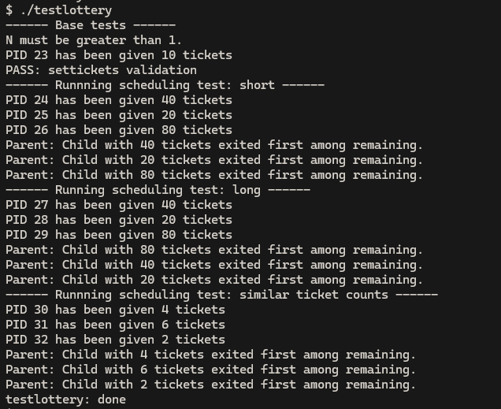

# Lottery Scheduler Experiment Results

## 1. Setup
The experiment was conducted on a modified xv6 kernel using a lottery scheduling algorithm. 
- **Environment:** xv6 on QEMU.
- **Process Count:** 3 child processes per test.
- **Ticket Distribution:** 
    - Test A (Short/Long): 20, 40, 80 tickets (Ratio 1:2:4)
    - Test B (Similar): 2, 4, 6 tickets (Ratio 1:2:3)

## 2. Workload
The workload consists of a CPU-bound loop within `testlottery.c`, which runs `burn()` an `n` amount of times. The short test loops around `10000000` times and the long `200050000`. `burn()` increments a counter.

Each child process executes the task to ensure they remain in the `RUNNABLE` state, demanding maximum CPU time from the scheduler.

## 3. Observed Relative Shares
Based on the results, there is a clear distinction between short-burst workloads and sustained workloads.

### Short Runs vs. Long Runs

- **Short Runs:** In the "short" tests, the exit order was inconsistent. For example, in Trial 1, the child with 20 tickets exited before the child with 80 tickets, and another the child with 40 exited before 20 and 80.

- **Long Runs:** In the "long" tests, the scheduler consistently favored the higher ticket counts. In all three trials, the exit order was 80 -> 40 -> 20.

### Convergence and Variance
The experimental data confirms the probabilistic nature of the lottery scheduler:
1. **Variance:** In the short term, "luck" (random number generation) plays a significant role. A process with fewer tickets can win several consecutive time slices.
2. **Convergence:** As the number of scheduling events ($n$) increases, the actual CPU time allocated to each process approaches the theoretical probability ($tickets / total\_tickets$). This is why the "Long" tests more accurately reflect the ticket ratios, while "Short" tests do not.

## 4. Conclusion
The implementation successfully validates that ticket counts influence CPU share. While high variance is present in small workloads, the scheduler achieves fair proportional sharing over longer execution periods.

### Result Screenshots

